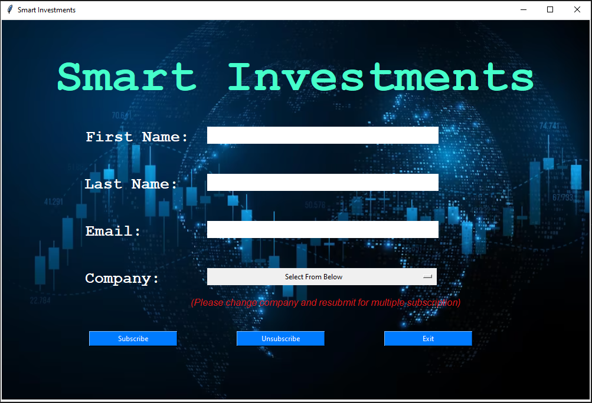

# Smart Investments — Stock Price Alerts & News (Tkinter)

A desktop app that lets people **subscribe to stock alerts** for popular companies. When a watched stock's price changes, the app emails subscribers with the **price delta** and **top related news headlines**.



## Features
- Tkinter GUI to **subscribe/unsubscribe** to company alerts
- Tracks daily open/close prices via **Alpha Vantage**
- Fetches recent related headlines via **NewsAPI**
- Sends email alerts to subscribers via **Gmail SMTP**

## Tech Stack
Python, Tkinter, `requests`, JSON file storage, SMTP (Gmail).

## Project Structure
```
.
├─ DB.py              # subscriber storage (JSON)
├─ emailCLI.py        # email sender
├─ main.py            # entry point
├─ news.py            # fetches headlines
├─ stock.py           # stock/price logic
├─ ui.py              # Tkinter UI
├─ assets/
│  └─ image89.png     # banner used by the UI
├─ saved-subscription.json   # (runtime data; don't commit)
├─ .env.example       # sample env vars (copy to .env)
├─ requirements.txt
└─ README.md
```

## Setup

1) **Clone** and create a virtual environment
```bash
git clone https://github.com/<YOUR-USERNAME>/<YOUR-REPO>.git
cd <YOUR-REPO>
python -m venv .venv
# Windows
.venv\Scripts\activate
# macOS/Linux
source .venv/bin/activate
pip install -r requirements.txt
```

2) **Create your `.env`** (copy the sample and fill in secrets)
```
cp .env.example .env  # macOS/Linux
# or just create .env on Windows
```
Fill in:
```
APP_EMAIL=youremail@gmail.com      # Gmail address used to send alerts
APP_PASSWORD=xxxx xxxx xxxx xxxx   # 16-char Gmail App Password (not your login)
NEWS_API_KEY=xxxxxxxxxxxxxxxx
STOCK_API_KEY=xxxxxxxxxxxxxxxx
```

3) **Run the app**
```bash
python main.py
```

## Environment variables
- `APP_EMAIL` / `APP_PASSWORD` — create a **Gmail App Password** (Google Account → Security → 2‑Step Verification → App passwords).  
- `NEWS_API_KEY` — get from https://newsapi.org  
- `STOCK_API_KEY` — get from https://www.alphavantage.co

> Keep `.env` and `saved-subscription.json` **out of Git** (see `.gitignore`).

## How it works
- `ui.py` renders the Tkinter window and writes subscriber info to `saved-subscription.json`.
- `stock.py` gets daily prices and computes % change; if subscribers exist, it fetches headlines and calls `emailCLI.py` to notify users.
- `news.py` pulls 1–3 headlines for the chosen company.
- `emailCLI.py` composes and sends simple text emails.

## Security & Privacy
- **Never hard‑code secrets** in the repo. Use `.env` as shown.
- `saved-subscription.json` contains user emails; don’t commit it.

## Roadmap ideas
- Batch/Lambda job for scheduled checks
- Packaged .exe/.app build
- SQLite/PostgreSQL instead of JSON file
- Attach charts, add unsubscribe link

## License
MIT (or your preference).
